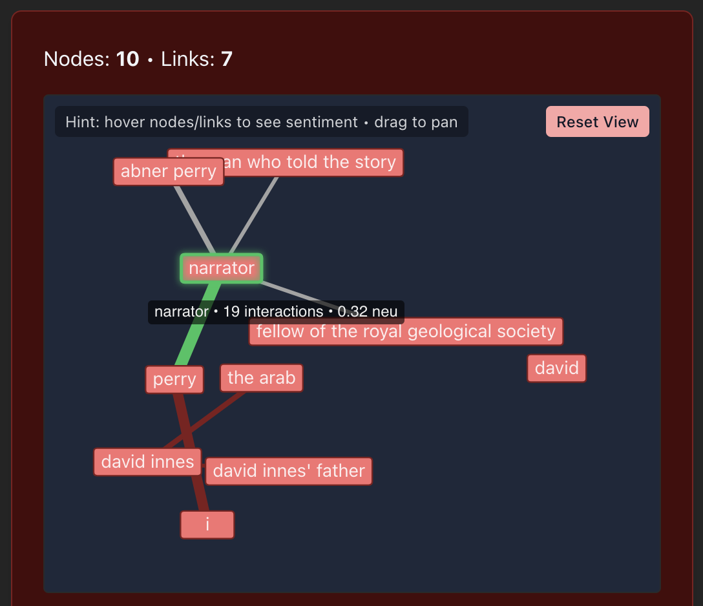
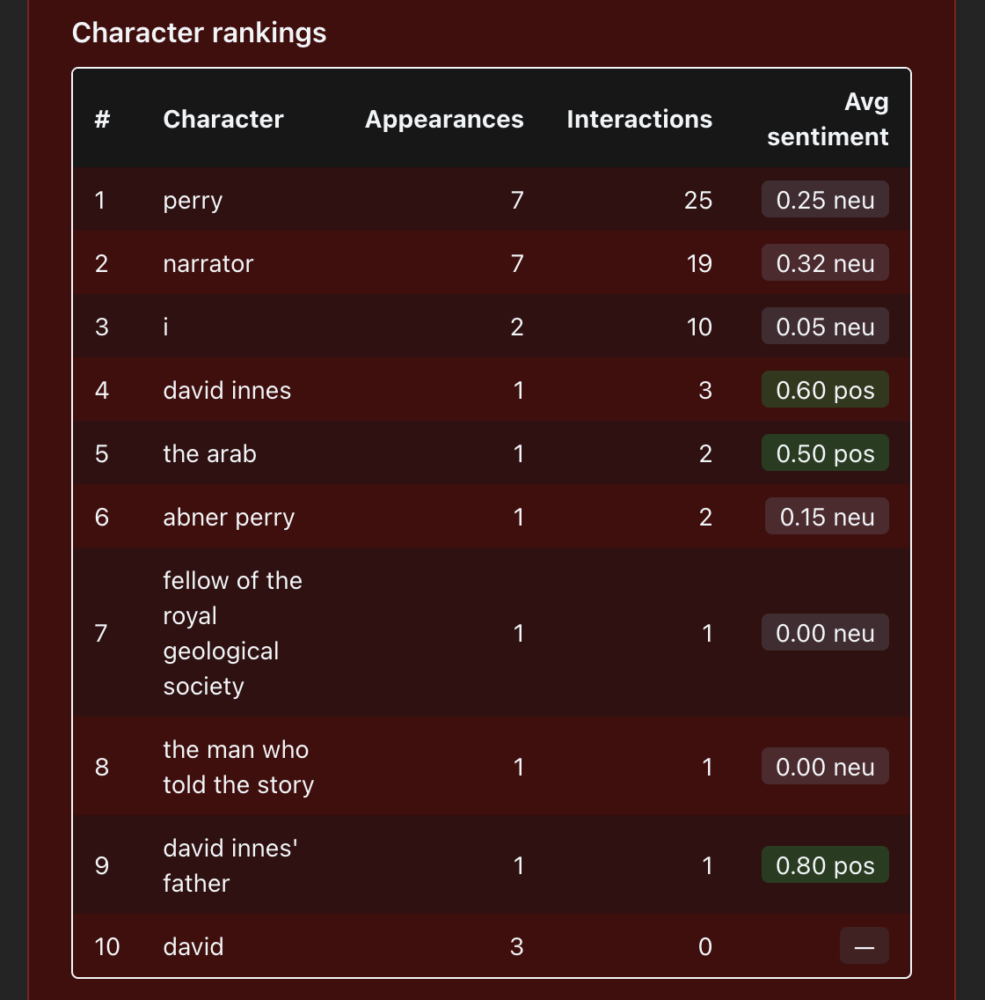

# Gutenberg Analyzer

A take-home project that analyzes characters and interactions in Gutenberg books.

- **Frontend:** React + Vite + Tailwind, deployed on Vercel
- **Backend:** Flask API with caching, deployed on Render
- **LLM:** Backend uses [dspy](https://github.com/stanfordnlp/dspy) to structure prompts and [Groq](https://groq.com) for inference

➡️ See [backend/README.md](backend/README.md) for API documentation

## Demo

0. **Loom**
   [Here is a quick demo video with Loom](https://www.loom.com/share/a0137725f55c41d3a97b5bfac26c0159?sid=cf12648d-d082-4262-88f7-69becd070440)

1. **Graph with sentiment hover**

<p align="center">
  
</p>

2. **Ranking table of characters by appearances**

<p align="center">
  
</p>

---

## Running Locally

### Backend

```bash
cd backend
pip install uv
uv sync
export APP_ENV=development
export GROQ_API_KEY=sk-local-xxx
uv run backend-dev   # Flask dev server on http://127.0.0.1:5001
```

### Frontend

```bash
cd frontend
npm install
npm run dev   # Vite dev server on http://127.0.0.1:5173
npm run tw:watch   # compile Tailwind CSS into public/ and keep watching
```

---

## Deployment Links

Frontend: [https://book-analyzer-app.vercel.app/](https://book-analyzer-app.vercel.app/)
Backend: [https://book-analyzer-app.onrender.com/](https://book-analyzer-app.onrender.com/api/health)

⚠️ Note: Render free-tier services sleep when inactive; first request after
inactivity may be slower (cold start).

## Key Decisions

Backend:

- **Decision:** Use dspy + Groq for LLM inference.  
  **Why:** Provides structured signatures, validation via Pydantic, no need for manual prompting. Groq was recommended and has fast inference.

- **Decision:** Add Flask-Caching.  
  **Why:** Expensive endpoints (book fetch + analysis) should be cached to improve responsiveness.

- **Decision:** Analyze text in chunks, enforce a maximum number of
  characters.  
   **Why:** Reduces context size, prevents oversized requests.

Frontend:

- **Decision:** Build custom graph visualization with react-force-graph.

  - Considered others like reagraph and cytoscape but above seemed nicer

- **Decision:** Add ranking table with derived stats.

- **Decision:** Add cancel button and loading state in frontend.

- **Decision:** Add theme toggle + Tailwind styling.

Deployment:

- **Decision**: Deploy frontend on Vercel and backend on Render instead of Vercel.
  Why: Vercel’s serverless functions hit the 250 MB unzipped size limit for the build
